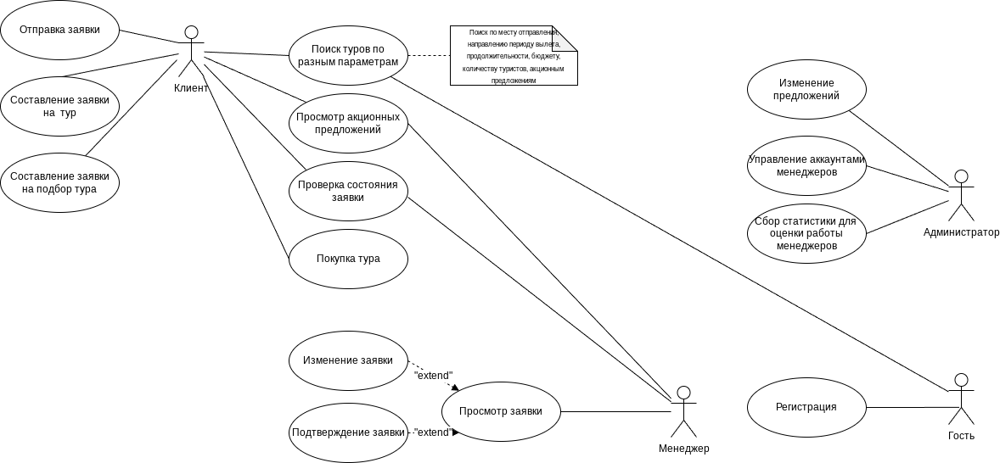
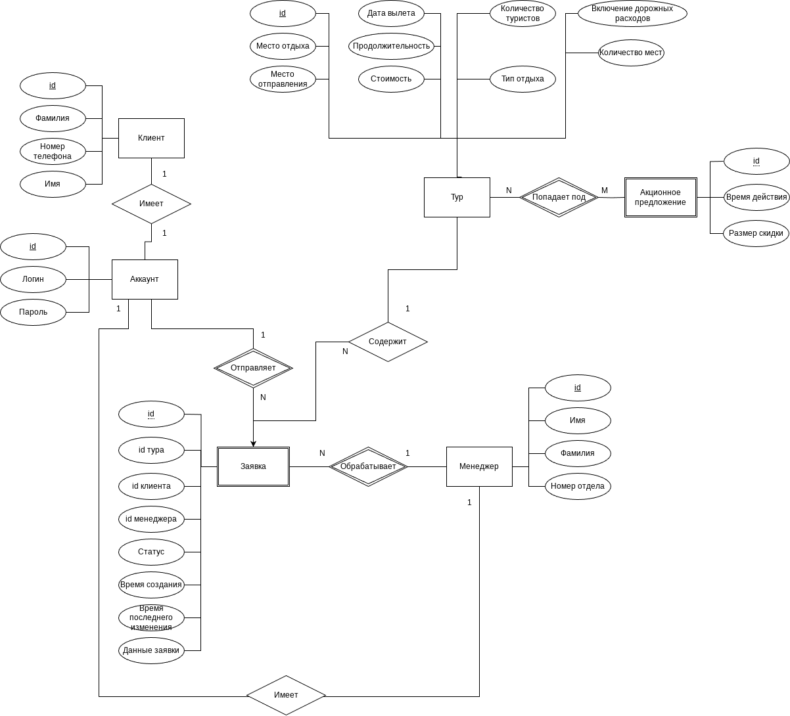
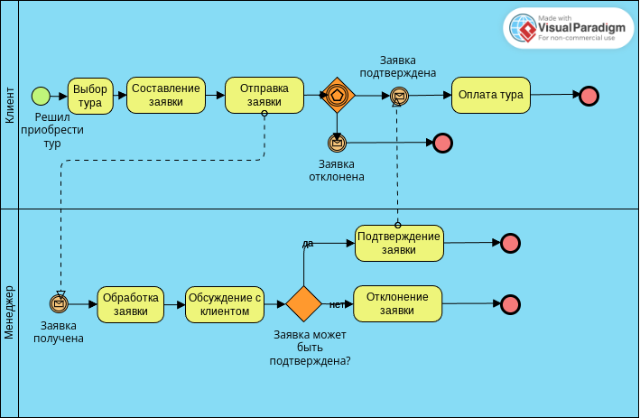
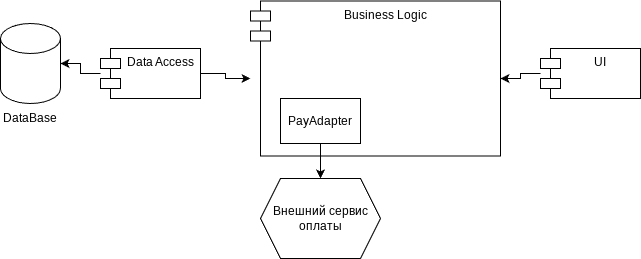
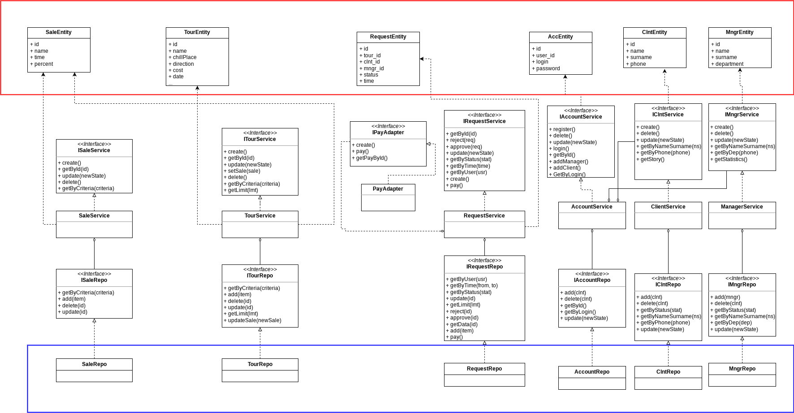

<h2 style="text-align: center;">Лабораторная работа №1</h2>
<h3 style="text-align: center;">Туристическое агентсво TrueTravel</h3>

---

## Содержание

- [Идея проекта](#идея-проекта)
- [Описание предметной области](#описание-предметной-области)
- [Анализ аналогичных решений](#анализ-аналогичных-решений)
- [Актуальность](#актуальность)
- [Описание ролей](#описание-ролей)
- [Use-case диаграмма](#use-case-диаграмма)
- [ER-диаграмма](#er-диаграмма)
- [Пользовательские сценарии](#пользовательские-сценарии)
- [Диаграмма бизнес-процесса](#диаграмма-бизнес-процесса)

## Идея проекта

 Проект, предоставляющий пользователям возможность выбора, бронирования и оформления заявок на последующую консультацию по интересующим турам.

## Описание предметной области

Клиент может выбирать туры, исходя из разных параметров (например, место отправления, место отдыха, период отправления, продолжительность, бюджет и т.п.). Выбрав тур, клиент имеет возможность создать заявку на этот тур. После отправки заявки она назначается какому-то менеджеру, который обрабатывает данную заявку, возможно, изменяя или дополняя ее после разговора с клиентом. Администратор может изменять доступные туры, акционные предложения, а также управлять менеджерами и оценивать количество обработанных ими заявок.

## Анализ аналогичных решений

  

    <table>
      <tr>
        <th>Аналог</th>
        <th>Поиск туров по разным параметрам</th>
        <th>Просмотр истории заявок</th>
        <th>Проверка заявки</th>
        <th>Поиск тура по типу отдыха</th>
      </tr>
      <tr>
        <td>CoralTravel</td>
        <td>да</td>
        <td>да</td>
        <td>да</td>
        <td>нет</td>
      </tr>
      <tr>
        <td>Travelata</td>
        <td>да</td>
        <td>нет</td>
        <td>да</td>
        <td>нет</td>
      </tr>
      <tr>
        <td>1001 тур</td>
        <td>да</td>
        <td>да</td>
        <td>нет</td>
        <td>да</td>
      </tr>
    </table>
  

## Актуальность

Туризм - сфера, актуальная во все времена. Выбор и планирование туров - это сложная задача, и если её выполнять самостоятельно, это может занять много времени. Поэтому проект, являющийся агрегатором туров и предоставляющий услуги бронирования различных путешествий, будет пользоваться популярностью и спросом.

## Описание ролей

В проекте предполагается четыре роли: гость, клиент, менеджер, администратор.

1. **гость** имеет возможность:
    1. зарегистрироваться;
    2. осуществлять поиск туров по разным параметрам;
    3. просматривать акционные предложения.
2. **клиент** имеет возможность:
    1. осуществлять поиск туров по разным параметрам;
    2. просматривать акционные предложения;
    3. составлять и отправлять заявки;
    4. проверять состояние заявки;
    5. просматривать историю заявок;
    6. приобретать тур после подтверждения заявки.
3. **менеджер** имеет возможность:
    1. осуществлять поиск туров по разным параметрам;
    2. просматривать акционные предложения;
    3. просматривать заявки, назначенные на менеджера;
    4. изменять заявки;
    5. подтверждать заявки.
4. **администратор** имеет возможность:
    1. изменять туры, акционные предложения;
    2. управлять аккаунтами менеджеров;
    3. сбор метрик работы менеджеров.

## Use-case диаграмма

## Сложные бизнес-правила

1. Сбор статистики для оценки работы менеджеров - можно будет выбрать параметр для составления списка топ-менеджеров. Критерии:
    1. эффективность работы: количество оплаченных заявок на общее количество заявок на менеджера;
    2. сумма продаж за определённый период.
2. Оплата заявки через платёжный сервис;
3. Аутентификация.

## ER-диаграмма

## Пользовательские сценарии

**Клиент**:
1. определяет параметры, по которым будет осуществлять поиск тура;
2. вводит параметры в форму;
3. просматривает туры, подходящие по введенным параметрам;
4. выбирает тур;
5. заполняет и отправляет заявку на тур;
6. ожидает изменения состояния заявки;
7. как только заявка подтверждается, оплачивает тур.

**Менеджер**:
1. просматривает список заявок, назначенных на него;
2. выбирает необработанную заявку;
3. связывается с клиентом;
4. изменяет заявку, если требуется;
5. утверждает заявку.

**Администратор**:
1. создает аккаунт для менеджера;
2. выдает менеджеру логин и пароль;
3. изменяет тур/акционное предложение.

## Диаграмма бизнес-процесса

<h2 style="text-align: center;">Лабораторная работа №2</h2>

---

## Содержание

- [Тип приложения](#тип-приложения)
- [Технологический стек](#технологический-стек)
- [UML диаграмма классов для компонента доступа к данным](#uml-диаграмма-классов-для-компонента-доступа-к-данным)
- [UML диаграмма классов для компонента бизнес-логики](#uml-диаграмма-классов-для-компонента-бизнес-логики)

## Тип приложения

Для приложения была выбрана модель Multipage Application

## Технологический стек
1. backend - Golang
2. СУБД - Postgresql
3. frontend - HTML, CSS, JavaScript 

## Верхнеуровневое разбиение на компоненты

Были выделены компонент бизнес-логики, компонент доступа к данным и компонент интерфейса.

## UML диаграмма классов для компонента доступа к данным и компонента бизнес-логики

